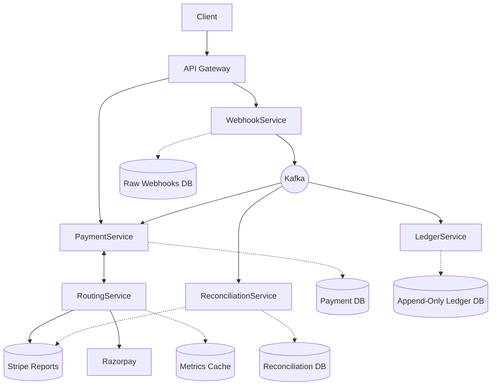
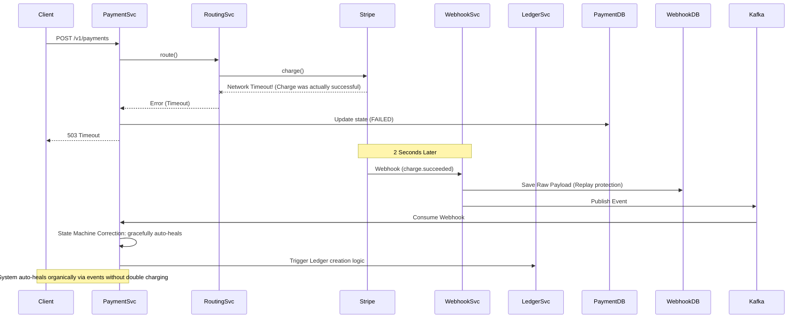
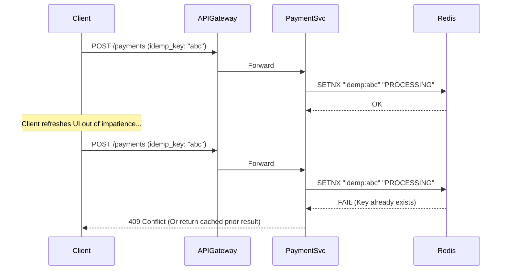
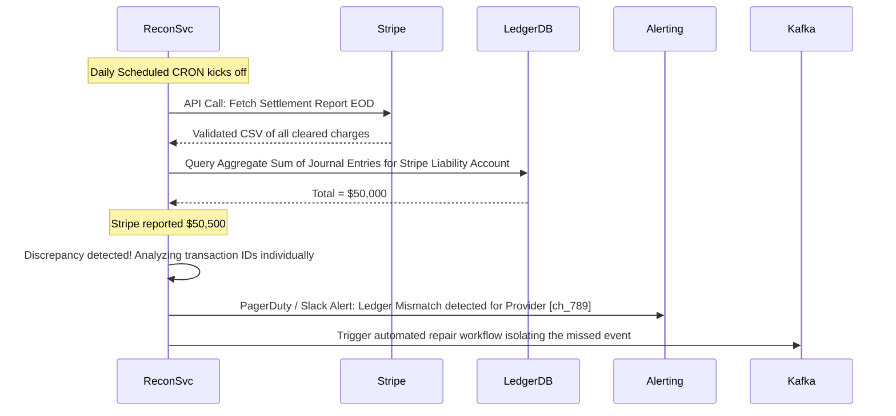

# Advanced Fault-Tolerant Payment Orchestration Platform

## 1. Service Decomposition & Updated HLD

To isolate failure domains and scale components independently, the monolithic structure is formally decomposed into 5 dedicated microservices:

1. **Payment Service:** Manages the core payment lifecycle, enforces the strict payment state machine, and handles client ingress/egress.
2. **Routing Service:** Calculates optimal provider routes in real-time based on success rates, latency, and cost configurations.
3. **Webhook Service:** Provides edge reliability. Validates signatures, prevents replay attacks, stores raw payloads, and ensures idempotent consumption.
4. **Ledger Service (Critical):** Fully isolated append-only financial system of truth.
5. **Reconciliation Service:** Scheduled CRON jobs that ingest provider settlement reports and detect discrepancies against the internal ledger.



## 2. Consistency Model & Justification

- **Strong Consistency (Ledger DB):** Financial transactions demand ACID guarantees. All journal entries for a single transaction must be committed inside a single atomic relational transaction. We cannot afford eventual consistency when recording debits/credits.
- **Eventual Consistency (Events via Kafka):** Status updates from external providers (Webhooks) traverse Kafka to update the `Payment DB`. This allows the system to remain highly available and absorb traffic spikes without locking core databases.
- **Anti-Entropy (Reconciliation):** The Reconciliation Service acts as the final consistency net, ensuring that even if Kafka drops an event or a bug skips a webhook, the provider's end-of-day truth cleanly matches our internal Ledger.

## 3. Webhook Reliability Layer

- **Replay Protection:** We store the `provider_event_id` in the `webhook_events` table with a UNIQUE constraint. If Stripe sends the same webhook twice, the DB rejects the duplicate automatically.
- **Raw Storage:** `webhook_events` stores the exact raw JSON string alongside parsed data. This is crucial for debugging, auditing, and playing back events in case of catastrophic downstream failures.
- **Out-of-Order Handling:** Webhooks can arrive out of order (e.g., `charge.captured` arriving before `charge.authorized`). The system handles this via the **Payment State Machine**, storing pending events if prerequisites aren't met, or gracefully jumping states if logical (e.g., accepting capture and implicitly inferring authorization).

## 4. Low-Level Design (LLD)

### Payment State Machine (LLD)

**Valid States:** `CREATED` $\rightarrow$ `AUTHORIZED` $\rightarrow$ `CAPTURED` $\rightarrow$ `REFUNDED`. Terminal: `FAILED`.

```java
public enum PaymentEvent {
    AUTHORIZATION_SUCCESS, AUTHORIZATION_FAILED, CAPTURE_SUCCESS, REFUND_INITIATED, REFUND_SUCCESS;
}

public class PaymentStateMachine {
    // Transition Table mapping (CurrentState, Event) -> NextState
    public PaymentState transition(PaymentState current, PaymentEvent event) {
        if (current == PaymentState.CREATED && event == PaymentEvent.AUTHORIZATION_SUCCESS) return PaymentState.AUTHORIZED;
        if (current == PaymentState.AUTHORIZED && event == PaymentEvent.CAPTURE_SUCCESS) return PaymentState.CAPTURED;
        if (current == PaymentState.CAPTURED && event == PaymentEvent.REFUND_SUCCESS) return PaymentState.REFUNDED;
        
        throw new InvalidStateException("Invalid transition from " + current + " via " + event);
    }
}
```

### Immutable Double-Entry Ledger (LLD)

**CRITICAL RULE:** We NEVER update account balances explicitly. An account's balance is purely the aggregate sum of its immutable journal entries over time.

```java
@Transactional
public void recordTransaction(UUID transactionId, List<JournalEntry> entries) {
    long totalCredits = entries.stream().filter(JournalEntry::isCredit).mapToLong(JournalEntry::getAmount).sum();
    long totalDebits = entries.stream().filter(e -> !e.isCredit()).mapToLong(JournalEntry::getAmount).sum();
    
    // Strict enforcement of the laws of accounting
    if (totalCredits != totalDebits) {
        throw new LedgerImbalanceException("Debits must equal Credits. Credits: " + totalCredits + " Debits: " + totalDebits);
    }
    
    // Append Only. No 'UPDATE' calls are made to any Account balance.
    journalEntryRepository.saveAll(entries);
}
```

## 5. Database Schema Improvements

**Table: `payment_state_transitions` (Audit Trail)**
- `id` (PK)
- `payment_id` (FK)
- `previous_state` (VARCHAR)
- `new_state` (VARCHAR)
- `reason` (VARCHAR)
- `created_at` (TIMESTAMP)

**Table: `webhook_events` (Reliability & Replay)**
- `event_id` (Provider's ID, PK - enforces idempotency)
- `provider` (VARCHAR - e.g., STRIPE)
- `raw_payload` (JSONB)
- `status` (PENDING, PROCESSED, ERROR)
- `received_at` (TIMESTAMP)

**Table: `journal_entries` (Immutable Ledger)**
- `entry_id` (PK)
- `transaction_id` (UUID) // Maps all correlated entries exactly 
- `account_id` (FK)
- `amount` (BIGINT) // Always strictly positive
- `type` (CREDIT/DEBIT)
- `timestamp` (TIMESTAMP) // Auditable historical chain

## 6. Advanced Routing Engine

The Routing Service queries internal Redis nodes for real-time sliding-window limits and speeds.
```java
public Provider route(PaymentRequest req, MerchantRoutingConfig conf) {
    List<Provider> options = getAvailableProviders();
    return options.stream()
        .max(Comparator.comparingDouble(p -> 
            (p.getSuccessRate() * conf.getSuccessWeight()) - 
            (p.getLatencyMs() * conf.getLatencyWeight()) - 
            (p.getCostBasis() * conf.getCostWeight())
        )).orElse(fallbackProvider);
}
```

## 7. Failure Scenarios (Sequence Diagrams)

### Scenario A: Provider Timeout After Charge Success
*Condition:* The Routing Service calls Stripe. Stripe charges the user's card successfully, but the network connection drops heavily before the HTTP 200 response reaches our Routing Service. Our system assumes failure initially.



### Scenario B: Duplicate Request Handling
*Condition:* The Client retries the exact same checkout payload randomly due to a laggy WiFi connection.



### Scenario C: Reconciliation Mismatch Detection
*Condition:* A webhook was entirely missed due to a catastrophic partial outage, and the Immutable Ledger is missing vital funds corresponding to clearing data in external bank accounts.


