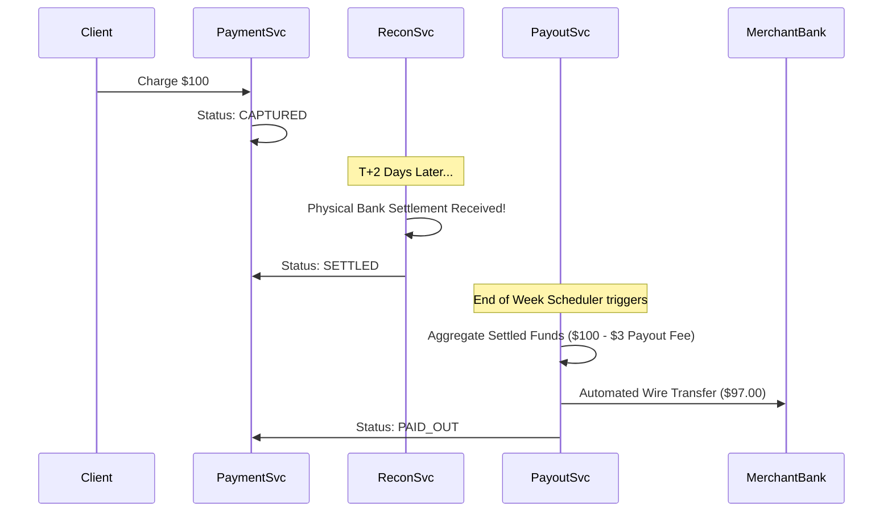
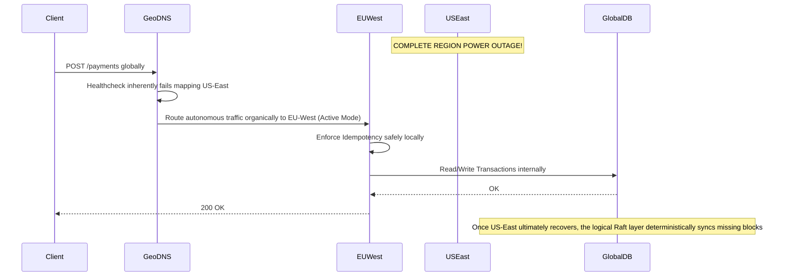

# Global-Scale Payment Orchestration Platform (Phase 3)

## 1. Global Multi-Region Architecture (Active-Active)
To achieve $\geq$ 99.999% availability globally, we utilize fundamentally resilient dispersed networking models:
- Clusters are completely isolated across macro **Regions** (e.g., US-East, EU-West, AP-South).
- **Active-Active Topology:** All traffic dynamically resolves via Geo-DNS (e.g., AWS Route53) to the healthiest and geographically closest region.
- **Global Data Replication:**
  - **Payment State:** CockroachDB / Google Spanner serves as the baseline providing strictly consistent, globally distributed state transactions leveraging Paxos/Raft.
  - **Global Idempotency Layer:** Redis Enterprise (Active-Active CRDTs) blocks cross-region replay loops. If US-East processes request `idemp_abc`, EU-West instantly knows.

```mermaid
graph TD
    Client --> GeoDNS[Global Geo DNS]
    GeoDNS --> USEast[US-East Region (API + Svc)]
    GeoDNS --> EUWest[EU-West Region (API + Svc)]
    
    USEast <--> |Global Spanner Replication| GlobalDB[(Distributed SQL - Spanner/Cockroach)]
    EUWest <--> |Global Spanner Replication| GlobalDB
    
    USEast <--> |CRDT Sync| RedisGlobal[(Global Redis / Idempotency)]
    EUWest <--> |CRDT Sync| RedisGlobal
    
    USEast --> StripeUS[Stripe US]
    EUWest --> AdyenEU[Adyen EU]
```

## 2. Settlement & Payout System (Deep Dive)
Payments are now abstracted far beyond simple REST captures into protracted, complex financial settlement lifecycles: 
**`AUTHORIZED` $\rightarrow$ `CAPTURED` $\rightarrow$ `SETTLED` $\rightarrow$ `PAID_OUT`**.

1. **CAPTURE:** Authorized funds are locked efficiently via Payment Providers.
2. **SETTLE:** Providers (Stripe) implicitly deposit the aggregate batched funds into our Corporate Bank Account (usually $T+2$ days length). The internal `ReconciliationService` verifies the physical bank deposit asynchronously and marks related ledger entries firmly as `SETTLED`.
3. **PAYOUT:** A dedicated **Payout Service** reads `SETTLED` ledger lines partitioned strictly by merchant. It mathematically aggregates the net balance minus platform fees, issues an ACH/Wire transfer to the merchant, and finally transitions the accounts to `PAID_OUT`.



## 3. Ledger Scalability & Sharding
For millions of transactions daily, a monolithic PostgreSQL DB will naturally bottleneck on raw write-heavy I/O.
- **Strategy:** Distinctly shard `journal_entries` mapped to the `merchant_account_id`.
- **Implementation:** Hash-based algorithmic partitioning ensuring data belonging to a single merchant uniformly hits the same disk.
- **Ordering:** Since financial equations are scoped cleanly to single merchant partitions, we enforce monotonic logical sequencing per partition.
- **Tradeoffs Evaluation:**
  - *Relational DBs (Postgres Sharded Matrix):* High maintenance burdens and complex schema migrations, yet ACID JOINS scaling effectively infinite on single shards natively.
  - *Distributed SQL (Spanner):* Easiest functional scaling curve with native cross-region ACID features; susceptible to severe latency hikes parsing distributed Paxos/WAN consensuses.

## 4. Adaptive Routing & ML Feedback Loop
Instead of static logical algorithms mapping cost and latency, the **Routing Engine** evaluates real-time behaviors dynamically.
- **Health Streaming:** Utilizing Flink/Kafka Streams constantly ingesting asynchronous `payment-events`.
- **Autonomic Circuit Disabling:** If a provider breaches a threshold (>$15\%$ failure rate in a 1-minute tumbling window), automated circuits flip to `OPEN` disabling volume instantly.
- **ML Overrides:** Lightweight gradient matrices predict probability outcomes against baseline historical feature vectors (`BIN`, `Amount`, `Currency`, `Time`).

## 5. Defense: Rate Limiting & Fraud Layer
- **Velocity Scanners:** Edge Gateway processes rigorous token-bucket strategies blocking irregular bulk-requests per IP or User ID metrics.
- **Fraud Profiling Engine:** Before pushing `AUTHORIZATION`, asynchronous heuristic models check user histories. Unsafe factors instantly trigger `3D-Secure` (SCA) authentication requirements blocking bots.

## 6. Schema Evolution
- **Kafka Schema Registries (Confluent):** All microservices transmit strictly structured `payment-events` governed identically by Avro/Protobuf versions.
- **Backward Compatibility Guidelines:** All incoming fields mutating schemas MUST be constructed explicitly as `Optional` (`default null`) to avoid dropping out-of-date Consumer parsers across legacy clusters.

## 7. Disaster Recovery: Region Outage Scenarios
*Condition:* The entire US-East data center fundamentally loses power resulting in terminal outages.


- **Ledger Replays:** Under extreme DB failure occurrences mapping beyond normal Multi-Region saves, the `WebhookService` holds historically permanent raw JSON traces inside Kafka cold-storage retaining 30+ day buffers able to safely replay histories recreating Ledgers accurately.
